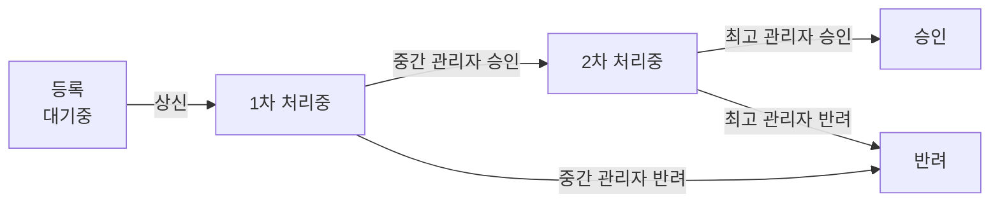

# 🗂️ ApprovalLine

> 사원의 비품 신청 내역을 직책별 결재 라인에 따라 승인 및 반려 처리하는 **사내 전자결재 웹 서비스**입니다.
<table>
  <tbody>
    <td>
      
    </td>
    <td>
      
    </td>
    <td>
      
    </td>
  </tbody>
</table>

<br>

- 기간: 1차 - 2024.07.01 ~ 07.31 (기능 구현) | 2차 - 2025.05.15 ~ 06.07 (인증 및 실시간 알림 고도화)
- 인원: 2인 (FE 1, BE 1)
- 역할: **프론트엔드 100%**

<br>

## 🛠️ 기술 스택

- **Frontend**: React 18, TypeScript, React Router 6, Redux Toolkit, axios, React-Bootstrap, WebSocket
- **Backend & DB**: Java, Spring Boot, PostgreSQL

<br>

## 🔄 결재 흐름




<br>
<br>

## 🚀 주요 기능 및 화면 구성

<table>
  <tbody>
    <tr>
      <th width="100%" align="center" colspan="2">01. 로그인 및 회원가입</th>
    </tr>
    <tr>
      <td align="center">
        
      </td>
      <td align="center">
        
      </td>
    </tr>
    <tr>
      <td align="center" colspan="2">부서 코드 인증 후 회원가입<br>로그인 후, 직책별로 분기 처리된 첫 화면으로 이동</td>
    </tr>
    <tr>
      <th width="100%" align="center" colspan="2">02. 대기 조회</th>
    </tr>
    <tr>
      <td align="center">
        
      </td>
      <td align="center">
        
      </td>
    </tr>
    <tr>
      <td align="center" colspan="2">신청 내역 등록 · 수정 · 삭제, 영수증 첨부 및 미리보기, 여러 건 일괄 상신<br>결재 상태 변경을 WebSocket으로 받아 Toast로 표시</td>
    </tr>
    <tr>
      <th width="100%" align="center" colspan="2">03. 주문 현황</th>
    </tr>
    <tr>
      <td align="center">
        
      </td>
      <td align="center">
        
      </td>
    </tr>
    <tr>
      <td align="center" colspan="2">직책별로 분기 처리된 조회 범위 적용<br>부서 · 사원 · 처리 현황(다중 선택) 필터 및 상세 조회</td>
    </tr>
    <tr>
      <th width="100%" align="center" colspan="2">04. 상신 조회</th>
    </tr>
    <tr>
      <td align="center">
        
      </td>
      <td align="center">
        
      </td>
    </tr>
    <tr>
      <td align="center" colspan="2">결재가 올라온 건 승인 및 반려 처리<br>반려 시, 반려 사유 필수 입력</td>
    </tr>
  </tbody>
</table>

<br>

## 💡 문제 해결

### 1. 목록을 새로 불러올 때만 갱신되던 알림을 WebSocket으로 개선

**문제 발생**

알림을 주문 목록 조회와 함께 가져와서, 결재 상태가 바뀌어도 목록을 새로 불러올 때만 알림이 갱신됐습니다.

**해결 과정**

처음에는 목록 조회에 임시로 붙여 두고, 쓰면서 드러난 문제를 하나씩 고쳐 나갔습니다.

1. **폴링으로 분리**: 알림 컴포넌트가 스스로 5초마다 알림을 조회하게 바꾸고 모든 화면에 표시. 화면을 벗어나면 `clearInterval`로 정리
> 알림이 없어도 5초마다 GET 요청이 계속 나감
2. **WebSocket으로 전환**: 결재 상태가 바뀌는 시점에 서버가 알림을 보내는 방식으로 변경
   - 브라우저 WebSocket API는 헤더를 보낼 수 없어, 연결 URL의 쿼리스트링으로 토큰 전달
   - 소켓을 `useRef`에 보관해 리렌더와 무관하게 연결을 유지하고, 정리 함수에서 연결 해제
> 받은 알림이 각 화면 컴포넌트 안에만 있어, 페이지를 이동하면 사라짐
3. **Redux store로 이동**: 받은 알림을 Redux Toolkit 전역 store에 쌓아 페이지를 이동해도 유지

**결과**

5초 주기 요청 없이 결재 상태 변경을 실시간 알림으로 받고, 페이지를 이동해도 받은 알림이 유지됩니다.

**[`Notification.tsx`](src/notifications/Notification.tsx)**
**[`NotificationSlice.tsx`](src/notifications/NotificationSlice.tsx)**

### 2. 실제 업무를 반영하지 못한 결재 구조를 전면 재설계

**문제 발생**

사용자가 신청하면 관리자가 처리하는 2단계 구조로 구현했으나, 시연에서 실제 사용 환경을 반영하지 못한 단순한 구조라는 피드백을 받았습니다.

**해결 과정**

실제 회사의 결재 프로세스를 조사·분석한 뒤, 기존 구조를 폐기하고 약 1주간 전면 재설계했습니다.


**결과**

실제 결재 프로세스를 반영한 시스템으로 시연에서 긍정적인 평가를 받았습니다.

### 3. 토큰을 재발급받아도 만료된 토큰으로 요청하던 문제

**문제**

refreshToken으로 토큰을 재발급받은 뒤에도 API 요청이 계속 인증에 실패했습니다. 각 컴포넌트가 렌더링할 때 읽어 둔 토큰 변수를 계속 쓰고 있었던 것이 원인이었습니다.

**해결**

- 페이지, 모달, 상단바 등 7개의 파일에서 요청을 보낼 때마다 최신 토큰을 읽도록 변경
- 재발급 응답에 비어 있는 사용자 정보가 기존 값을 덮어쓰지 않도록 방어

**결과**

재발급된 토큰이 다음 요청부터 바로 적용되었습니다.

**[`JWTToken.tsx`](src/components/JWTToken.tsx)**
**[`Home.tsx`](src/pages/Home.tsx)**

<br>

## 💻 포팅 매뉴얼

로컬 개발 환경에서 프로젝트를 구동하기 위한 설치 및 실행 가이드입니다.

### 1. 사전 요구사항

프로젝트에 사용된 Create React App(react-scripts 5) 구동을 위해 아래 버전 이상을 권장합니다.

- Node.js: v16 이상 (v18.x 권장)
- npm: v8 이상

### 2. 저장소 클론

터미널을 열고 프로젝트를 다운로드한 후 해당 디렉토리로 이동합니다.

```bash
git clone https://github.com/Ourumo/ApprovalLine.git
cd ApprovalLine
```

### 3. 의존성 패키지 설치

프로젝트 구동에 필요한 라이브러리를 설치합니다.

```bash
npm install
```

### 4. 환경 변수 설정

프로젝트 루트 디렉토리에 `.env` 파일을 생성하고 백엔드 서버 주소를 입력합니다.

```bash
# Backend API · WebSocket
REACT_APP_SERVER_URL=YOUR_SERVER_URL_HERE
```

### 5. 개발 서버 실행

로컬 개발 서버를 구동합니다. 로그인과 데이터 조회를 위해 [백엔드 서버](https://github.com/SunJinInternShip/DeptManagement_BackEnd)가 함께 실행되어 있어야 합니다.

```bash
npm start
```

<br>

## 참고

- [FrontEnd](https://github.com/SunJinInternShip/DeptManagement_FrontEnd)
- [BackEnd](https://github.com/SunJinInternShip/DeptManagement_BackEnd)
- [Figma](https://www.figma.com/design/Z1c764VvTFJOyaH4kzaQhz)
<!-- TODO: 노션 · Figma 링크는 공개해도 되는지 확인한 뒤 추가 -->
